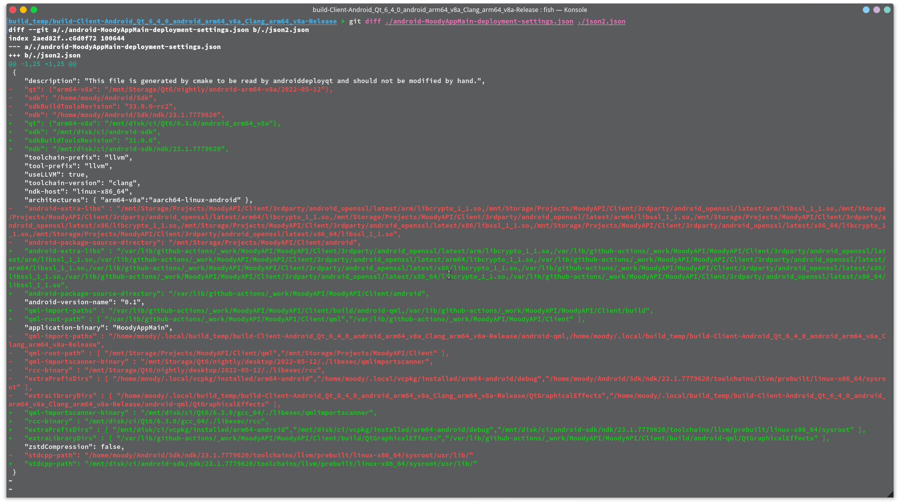
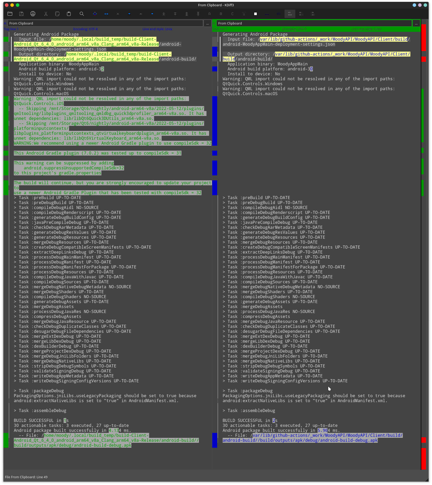

## 你这 `androiddeployqt` 可能没法正常 deploy Qt

### 一些无聊的概念

1. _Moody's Utility Bot_ 是一个与[此仓库](https://github.com/moodyhunter/MoodyAPI) GitHub Actions ~~梦幻联动~~ 的 Telegram Bot

   - 负责发送消息和最新 build 产物，
   - ~~同时也负责提醒蔡队起来（出处：["我起来了"](https://github.com/moodyhunter/MoodyAPI/blob/1f1d32a8c761c7c13d486cd4e7af657e838cd44f/Server/main.go#L70)）~~

2. Qt 是 ……

   - 这还用介绍吗

3. QtGraphicalEffects 是 ……

   - Qt5 时期的一个 Qt module，顾名思义负责 “图形特效” 比如渐变，阴影甚至 GLSL 效果
   - 但在 Qt6 中被 deprecate 了
   - 但我硬是强行将其 port 到 Qt6，其实是一种 “又不是不能用” 的状态

### 《开端》？

2022 年 5 月 1 日凌晨 1 点 00 分 56 秒：

> Moody's Utils Bot:
>
> Successfully built the client app, [File : MoodyAppMain.apk]

我随即下载并安装了新版 `MoodyAppMain.apk`，~~笑死~~，直接崩掉。

当时我心里很清楚这玩意已经炸了一个月了，从愚人节当天的 [ad042600](https://github.com/moodyhunter/MoodyAPI/commit/ad042600dfed5bc44efe5fccca7888ae8247befd) 以后就全盘裂开，但这 commit 只是简单的升级了一下 Qt 版本（622 到 630），并不应该引入新的问题。

为什么那天要迁移 Build Server？ 答：之前的编译机炸了。

因为前段时间有考试，此时（五月一号）还处于考完试疯玩期间，就并没有对此进行调查。

…………

### 复现

意思是这个 bug 4 月 1 号的 commit 开始出现，一直咕到现在才开始修（大概是玩够了，该老老实实把 broken build 修一修了），于是我开始重新拿起 QtCreator

首先使用 QtCreator 直接编译（我都多长时间没写过 QML 了）

- 首先我得 Build 个 Qt，或者从 Qt installer 下载一份 Qt for Android，但是我有 [QtBuildScript](https://github.com/moodyhunter/QtBuildScript)，直接 `./build-qt.fish -p android -a x86_64` 即可编译 Qt ~~（什么王婆卖瓜环节）~~
- 在等了半个小时以后，打开 QtCreator 并（从头）（重新）配置 Qt 环境（这种东西没必要赘述）
- 使用以下 CMake 参数~~（这个得记，下次要考）~~ 进行 configure 并开始 build

  ```cmake
  -DCMAKE_TOOLCHAIN_FILE=/PATH/TO/VCPKG/scripts/buildsystems/vcpkg.cmake
  -DVCPKG_CHAINLOAD_TOOLCHAIN_FILE=/PATH/TO/NDK/build/cmake/android.toolchain.cmake
  -DVCPKG_TARGET_TRIPLET=x64-android
  ```

  上文 CMake 参数只适用于在 QtCreator 中使用 vcpkg 和 Android toolchain，而在命令行
  中使用 qt-cmake 则需要另一个变量

  也就是把 `CMAKE_TOOLCHAIN_FILE` 换为 `QT_CHAINLOAD_TOOLCHAIN_FILE`

随后启动 Android 虚拟机进行测试，结果 **BANG**

```log
W MoodyApp: QQmlApplicationEngine failed to load component
W MoodyApp: qrc:/client/api/mooody/me/qml/main.qml:5:1: module "QtGraphicalEffects" is not installed
W MoodyApp: exit app 0
```

- 想起之前写过一篇 [`qt_add_qml_module`](https://mooody.me/p/qt6-porting-guide-cmake/) CMake 函数的"详"解，但现在反过来看了看，并没有着重说明 `IMPORT_PATH` 的重要性，于是打开 [Qt 文档 (dev 分支版)](https://doc-snapshots.qt.io/qt6-dev/qt-add-qml-module.html#qt6-add-qml-module)

- 文档里说：_`IMPORT_PATH` 可以用来添加被依赖的 QML 模块的搜索路径。这里指定的位置需要包含 `qmldir` 文件来标明此文件夹代表了一个 QML 模块。_

那看来我加一个就行？在项目里添加了 `IMPORT_PATH ${CMAKE_BINARY_DIR}` 并重新 build，果然效果拔群！

到现在为止，程序成功地在 Android VM 中运行了。于是我又进行了一轮实体机的测试，终于成功在生产环境（一台三星手机）上成功运行起这个 APK。

最后的最后，我进行了 `git push`，并准备休息

### 就这？就这能水一篇文章？

咕了一个月的 bug 仅两行代码就能修好？

别急，本文标题所说的 `androiddeployqt` 还没出场呢

在 [commit](https://github.com/moodyhunter/MoodyAPI/commit/9f6512c3fb7a94e377a2a7f55ddcb5d4ef72b75e) 的时候，我就暗自怀疑："Is it simple like this?"，哈哈事实证明：不可能的

就在两分钟后，编译机将 CI 环境下编译完成的 APK 自动发送到了 Telegram 群，我立即安装并打开，结果竟然**又**闪退了

这下我人麻了，从头顶麻到脚尖。

> 我之前的开发过程中可都没出现过 CI 产物没法用的问题啊

### 刨根问底

大概不用讲道理，Android 上调试肯定得搬出 `adb logcat`：

```log
26896  4836 W MoodyApp: QQmlApplicationEngine failed to load component
26896  4836 W MoodyApp: qrc:/client/api/mooody/me/qml/main.qml:5:1: module "QtGraphicalEffects" is not installed
26896  4836 W MoodyApp: exit app 0
```

- 这怎么和上面的 output 一模一样啊，不是修好了吗？
- 我的 QtGraphicalEffects 又去哪了？

#### 拆包（解压）

稍微理解一些 Qt/QML 的读者可能会知道，一个 QML 模块其实对应了一个（或两个，或零个）动态库，而 Android 打包
过程中是会把这些依赖的动态库打进 APK 的。

所以为了仔细研究 APK 里的内容，我选择使用 ~~KDE 精品压缩文件查看器~~ Ark 打开 APK 一探究竟：

（图很小，理论上可以直接右键看源文件）


打开源文件图片以后，就可以很清晰地看到 QtGraphicalEffects 并没有在 `lib/` 文件夹内

- 啥叫 "可以很清晰地看到 xxx 没在"？
- ~~anyway~~

依赖的 so 没在 APK 包里，这肯定是某些 deployment 的问题

#### CI Log

经过对比，CMake Configure 输出和本地 build 时的输出并无区别，Qt 版本也一致，那么问题就被缩减到了 deployment 过程上。

我使用 `cmake --build . --parallel --verbose` 让 CMake 在 build 过程中输出详细内容，大概就是每一
步骤运行的程序，发现 Qt 在 Android 平台的 deployment 其实是一个名为 `androiddeployqt` 的程序进行的，
它详细的参数是：

```bash
# 稍微 format 了一下，不然没法给人看
# 部分内容做了 placeholder 处理，因为源目录太长了
# BUILDDIR 表示 build 目录
# PATH_TO_QT 表示 Qt （host 版本） 安装路径（不是 Android）
/PATH_TO_QT/bin/androiddeployqt \
    --input /BUILDDIR/android-MoodyAppMain-deployment-settings.json \
    --output /BUILDDIR/android-build \
    --apk /BUILDDIR/android-build/MoodyAppMain.apk \
    --depfile /BUILDDIR/android-build/MoodyAppMain.d \
    --builddir /BUILDDIR
```

可以明显看到传入参数是 `android-MoodyAppMain-deployment-settings.json` 这只 JSON

大概是本能反应？打开了本地能用的 JSON 文件进行对比：

这种玩意一般人都看不懂吧：


整篇都是 path 不同导致的 diff，简直要命。所以我将 JSON 里的绝对路径改为了 `/SOURCE`, `/BUILDDIR` 一类的 placeholder，diff 得出以下结果：

```diff
diff ./android-MoodyAppMain-deployment-settings.json ./json2.json
5c5
<    "sdkBuildToolsRevision": "33.0.0-rc2",
---
>    "sdkBuildToolsRevision": "31.0.0",
16d15
<    "application-binary": "MoodyAppMain",
18a18
>    "application-binary": "MoodyAppMain",
```

忽略 16/18 行的顺序问题，我发现 sdk 版本出现了不一致。但在 CI 机器上安装同样版本的 Android SDK 后，
build 出来的 APK 仍然不包含 QtGraphicalEffects 模块。

### 咋回事呢？

检查了 `androiddeployqt` 的参数，是不是该检查一下输出了：

似乎没有什么有意义的：



#### `--verbose`？

无意间发现 `androiddeployqt` 有 `--verbose` 选项，打开 verbose 后，事情出现了转机：


什么叫 `is in QML root path`，当我回去检查 `android-MoodyAppMain-deployment-settings.json` 时发现：

- CI 环境的 build 目录在 `SOURCE/build`，很明显 `SOURCE` 就是 QML root path；
- 而本地开发环境，由于统一管理了 build 产物，默认的 `CMAKE_BINARY_DIR` 位于 `~/.local/build_temp`

这就导致 `BUILDDIR/QtGraphicalEffects` 在 CI 环境和开发环境处于了不同的相对位置：

- CI 环境下，位于 QML root path 子目录
- 开发环境下，反之，处于别的地方

### 核心问题

位于 [src/tools/androiddeployqt/main.cpp:L2011](https://github.com/qt/qtbase/blob/dev/src/tools/androiddeployqt/main.cpp#L2103) 调用的 `checkQmlFileInRootPaths(const Options*, const QString &)` 可知：

这个函数无脑（只）检查了子目录，而并检查「即使 module 位于子目录，能否通过 import URI 导入此 module」，因此
导致 SOURCE 下的所有 QML module 都会被认为 "位于 QML import path 内"，但事实并非如此：

这个 QML import path 不会被 deploy 到 APK 里面，那自然里面的 QML module 就全丢了：）

### 后续

给 Qt 发了个 patch [qtbase@411805](https://codereview.qt-project.org/c/qt/qtbase/+/411805)，
希望能帮上忙，~~但说实话我也不确定是否应该这样修~~

## 结语

睡觉，晚安
