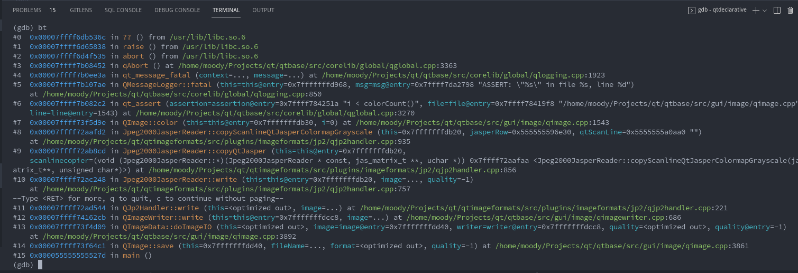

**放假了!**

~~由于 qmlls 崩溃了一整天，我终于放弃调查了，于是开始水群：~~

`#archlinux-cn`:

> **CuiHao**: _最近 Spectacle 和 Plasmashell 在截图后疯狂 segfault，有人遇到吗_\
> **CuiHao**: `#4 0x00007fd47872e774 in jas_stream_putc_func () from /usr/lib/libjasper.so.6` _Spactacle 崩这儿了_\
> **hosiet**: _libjapser? 为啥 arch 还在用这个_\
> **CuiHao**: _<https://bugs.kde.org/show_bug.cgi?id=455362>_ _扔了个 bug，但感觉是 qt 的 bug_\
> **csslayer**: _不能修一下吗，是不是什么时候就和 jasper 不兼容了_ \
> **CuiHao**: _<https://bugreports.qt.io/browse/QTBUG-104398> 报了反正_

~~仔细~~查看 `QTBUG-104398` 后，我也在本地成功用 Qt 6.5 复现了这个 crash：

首先写一个 cpp

```cpp
#include <QCoreApplication>
#include <QImage>

int main(int argc, char *argv[])
{
    QCoreApplication a(argc, argv);

    QImage image(64, 64, QImage::Format_Grayscale8);
    image.fill(0);
    image.save("test.jp2");

    return 0;
}

```

然后尝试编译：

```bash
- > export MY_QT_PATH="$HOME/Projects/qt/build/qtbase"
~ > g++ ./main.cpp \
    -I "$MY_QT_PATH/include" \
    -I "$MY_QT_PATH/include/QtCore" \
    -I "$MY_QT_PATH/include/QtGui" \
    -L "$MY_QT_PATH/lib" \
    -lQt6Core \
    -lQt6Gui \
    -o test
```

运行并进行爆炸观测：

```bash
~ > LD_LIBRARY_PATH="$MY_QT_PATH/lib" ./test
WARNING: YOUR CODE IS RELYING ON DEPRECATED FUNCTIONALITY IN THE JASPER
LIBRARY.  THIS FUNCTIONALITY WILL BE REMOVED IN THE NEAR FUTURE. PLEASE
FIX THIS PROBLEM BEFORE YOUR CODE STOPS WORKING.
deprecation warning: use of jas_init is deprecated
warning: The application program did not set the memory limit for the JasPer library.
warning: The JasPer memory limit is being defaulted to a value that may be inappropriate for the system.  If the default is too small, some reasonable encoding/decoding operations will fail.  If the default is too large, security vulnerabilities will result (e.g., decoding a malicious image could exhaust all memory and crash the system.
warning: setting JasPer memory limit to 16715984896 bytes
fish: Job 1, './test' terminated by signal SIGSEGV (Address boundary error)
```

首先映入眼帘的就是一串大写的 `WARNING`："你的代码用了老旧 API，这 API 马上就要删了 blablablabla……"，随后是
关键性的 `use of jas_init is deprecated`\
而这之后是一个没有设置内存上限的警告\
再之后就是爆炸现场了：`'./test' terminated by signal SIGSEGV`

首先使用 gdb 进行一个 backtrace 的查：



可以观测到（`#6`）这里的一个 ASSERT 炸掉了：

```cpp
QRgb QImage::color(int i) const
{
    Q_ASSERT(i < colorCount());
    return d ? d->colortable.at(i) : QRgb(uint(-1));
}
```

继续跟进后，发现 `colorCount()` 的返回值是 `0`，即 Color Table 的大小为 0，后来经过研究发现是这个
复现例子写错了：

> If format is an indexed color format, the image color table is initially empty
> and must be sufficiently expanded with `setColorCount()` or `setColorTable()` before
> the image is used.

（尽管同样是崩溃，但 `QImage::Format_Grayscale8` 导致没初始化 color table 触发的崩溃与 Jasper 无关）

于是把 `QImage::Format_Grayscale8` 改成 `QImage::Format_RGB32` 后，得到了另一个错误：


再次查看源码，可以得知 `memory_stream` 其实是个 `nullptr`：

```cpp
// Open an empty jasper stream that grows automatically
jas_stream_t * memory_stream = jas_stream_memopen(0, -1);

// Jasper wants a non-const string.
char *str = qstrdup(jasperFormatString.toLatin1().constData());
jas_image_encode(jasper_image, memory_stream, fmtid, str);
delete[] str;
jas_stream_flush(memory_stream);
```

最后定位到根本原因是 `jas_stream_memopen` 的第二个参数不应为 `-1`，而应该是 0。

传入 `-1` 后会因为参数类型是 `size_t` 而被转换成 `18446744073709551615`，由于无法进行如此巨大量的 malloc 分配，
`jas_stream_memopen` 返回了 0，也最终导致在后续函数中进行了空指针解引用。

于是一篇文章就这么水完了 :)

- 为对应的函数添加 Deprecated 警告: <https://github.com/jasper-software/jasper/pull/327>
- 为 JasPer 3 使用新的 API <https://codereview.qt-project.org/c/qt/qtimageformats/+/417088>
- 修复错误的 buffer size: <https://codereview.qt-project.org/c/qt/qtimageformats/+/417082>
